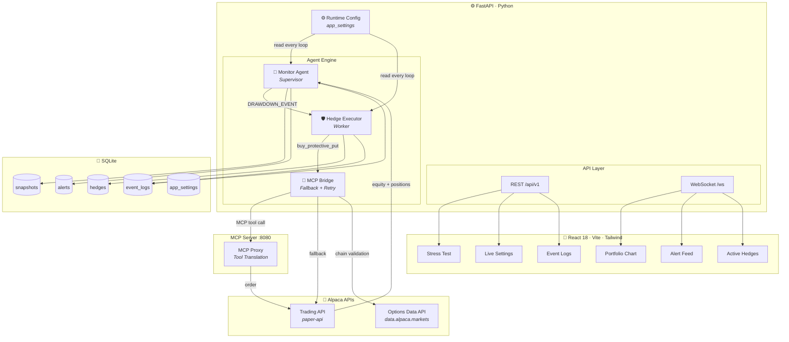

<div align="center">


<!-- BADGES — ROW 1: PLATFORM -->
[](https://lablab.ai/event/alpaca-ai-trading-agents-hackathon)
[](https://lablab.ai)
[](#)
[](https://github.com/builtbyrehan/Hedgify/pulls)

<!-- BADGES — ROW 2: LIVE COUNTERS (light up when repo goes public) -->
[](https://github.com/builtbyrehan/Hedgify/stargazers)
[](https://github.com/builtbyrehan/Hedgify/network)
[](https://github.com/builtbyrehan/Hedgify/issues)
[](https://github.com/builtbyrehan/Hedgify/commits)
[](#)

<p align="center">
  
</p>

</div>

> **Hedgify watches your stocks 24/7, and the moment your portfolio drops past its threshold, it buys real protective put options on Alpaca — automatically. You keep every share. Your downside is capped. You sleep.**

---

## 📺 Live Terminal

<div align="center">

```bash
$ python -m uvicorn main:app --reload

🟢 Monitor Agent started — watching your portfolio
📊 Portfolio: $97,076.14 | Cash: $96,801.42 | Peak: $97,086.49 | Drawdown: 0.01%
✅ All clear — portfolio healthy

                                … the market dips …

🚨 DRAWDOWN ALERT: 3.00% — firing hedge event!
🔧 Executor processing alert #10 for NVDA
🔎 Chain match: NVDA260918P00123000 (target $123.50)
🧾 REAL ORDER: NVDA260918P00123000 | status=accepted
✅ Hedge active: NVDA Put @ $123.50, expires 2026-09-18

⚙️  operator flips kill-switch →
⏸️  Autonomous hedging disabled — alert acknowledged, no order placed
```

**Every line above is real system output. Nothing is simulated.**

</div>

---

## 🎯 The Problem

When retail investors hold equity portfolios, unexpected market shocks cause rapid, unrecoverable drawdowns. Standard stop-loss mechanisms **force complete liquidation** — crystallizing losses, triggering tax liabilities, and causing investors to miss rebounds.

| | Stop-Loss | **Hedgify** |
|---|---|---|
| On a crash | 🏳️ **sells everything** | 🛡️ **buys insurance** |
| Your shares | gone | **100% kept** |
| Upside after rebound | missed | **fully captured** |
| Emotion | panic | **sleep** |

---

## ⚡ What It Does

| Feature | Status | Description |
|---|---|---|
| 🔍 **Real-Time Monitoring** | ✅ | Polls Alpaca paper trading — interval **live-tunable** (10s demo / 15 min prod) |
| 📉 **Drawdown Detection** | ✅ | Peak-to-trough math; alerts the instant the threshold is crossed |
| 🤖 **Multi-Agent Orchestration** | ✅ | Supervisor (Monitor) → event handoff → Worker (Executor) |
| 🛡️ **Real Options Execution** | ✅ | Queries the **live options chain**, matches the closest listed strike, places **real orders** |
| 🔄 **Idempotency Guard** | ✅ | Duplicate insurance? Blocked. Capital saved. |
| ⏯️ **Runtime Kill-Switch** | ✅ | Disable hedging mid-crisis — agents obey on their next loop, **no restart** |
| 📡 **WebSocket Live Push** | ✅ | Alerts + hedge confirmations hit the dashboard instantly |
| 💾 **Full Audit Trail** | ✅ | SQLite: snapshots, alerts, hedges, event telemetry |
| 📊 **React Dashboard** | ✅ | Portfolio chart · alert feed · hedges · logs · stress test · **live settings** |
| 🧪 **Stress Test Simulator** | ✅ | Synthetic crash → hedged vs unhedged → **CPR gauge** |
| 🔐 **API Authentication** | ✅ | All endpoints protected with API key auth |
| 🛡️ **Async HTTP Client** | ✅ | Non-blocking Alpaca API calls (no event loop freeze) |
| 🔌 **MCP Bridge** | ✅ | Model Context Protocol — MCP Server + fallback to direct Alpaca API |

---

## 🏗️ Architecture



---

## 🧠 The Agentic Pipeline

```
┌─────────────────┐     ┌──────────────────┐     ┌──────────────────┐     ┌──────────────────┐
│  Monitor Agent  │────►│  DRAWDOWN_EVENT  │────►│  Hedge Executor  │────►│   MCP Bridge     │
│   (Supervisor)  │     │  {symbol, drop}  │     │     (Worker)     │     │  (Fallback)      │
│                 │     │                  │     │                  │     │                  │
│ • Polls Alpaca  │     │                  │     │ • kill-switch?   │     │ • hallucination  │
│ • Tracks peak   │     │                  │     │ • idempotency    │     │   guard          │
│ • Detects drop  │     │                  │     │ • budget check   │     │ • MCP primary    │
│ • Fires event   │     │                  │     │ • bridge call    │     │ • direct fallback│
└─────────────────┘     └──────────────────┘     └──────────────────┘     │ • retry 3x       │
                                                                         └────────┬─────────┘
                                                                                  │
                              ┌───────────────────────────────────────────────────┘
                              ▼
                    ┌──────────────────┐     ┌──────────────────┐
                    │   MCP Server     │────►│   Alpaca APIs    │
                    │   (port 8080)    │     │  Trading + Data  │
                    └──────────────────┘     └──────────────────┘
                              │                         │
                              ▼                         ▼
                    ┌───────────────┐           ┌───────────────┐
                    │ SQLite + logs │           │ SQLite + logs │
                    └───────────────┘           └───────────────┘
                              │                         │
                              └────────────┬────────────┘
                                           ▼
                                 ┌──────────────────┐
                                 │  WebSocket Push  │──► 🎨 React Dashboard
                                 └──────────────────┘
```

---

## 🛠️ Tech Stack

<div align="center">

<a href="https://www.python.org/" target="_blank"></a>


</div>

---

## 🧪 Verified Behaviors — Proof, Not Promises

✅ **Real options fills:** `META260918P00495000` filled @ **$0.24** · `GOOGL260918P00170000` filled @ **$0.04**

✅ **Smart strike matching:** agent targets 5% OTM → buys the closest **listed** strike (`$495` when `$494` doesn't exist — real chains only have real strikes)

✅ **Runtime kill-switch:** `PUT /config {"autonomous_hedging": false}` → executor acknowledges & skips alerts **mid-loop, zero restart**

✅ **Idempotency in action:** 16 consecutive alerts on one symbol → exactly **1** hedge order

✅ **Graceful failure:** pre-market queues and API rejections mark alerts `failed`, log full error bodies, **never phantom-fill** the database

✅ **Live reconfiguration:** threshold / OTM / expiry / poll-interval — persisted in DB, obeyed by agents instantly

---

## 💥 Integration Diary

<details>
<summary><b>The 6-attempt journey from 422 to our first real fill</b> — click to expand</summary>

Building against Alpaca's Options API (two different hosts!) produced the most educational debug of the hackathon:

| # | Error | Root Cause | Fix |
|---|---|---|---|
| 1 | `422 Unprocessable Entity` | Options data isn't on the trading host | Discovered the split-host architecture |
| 2 | `NameError: logger` | Missing import in new module | 1-line fix |
| 3 | `[Errno 11001] getaddrinfo failed` | **Invented** hostname `data-api.alpaca.markets` | Real host: `data.alpaca.markets` |
| 4 | `unexpected query parameter(s): expiration_date_equal` | Wrong param name | Corrected |
| 5 | `500 rows returned, 0 for our expiry` | Pagination cliff — 500-row page missed our date | `page_token` loop + OCC-symbol client-side filter |
| 6 | ✅ **`status=accepted` → filled** | — | 🎉 First real hedge in Hedgify history |

**Lesson:** every API boundary hides a different contract. Diagnostics-first error handling (log the response *body*, not just the status) turned blind 422s into a one-attempt fix.

</details>

---

## 🚀 Quick Start

<details open>
<summary><b>▶ Backend</b></summary>

```bash
git clone https://github.com/builtbyrehan/Hedgify.git
cd Hedgify/backend

python -m venv venv
.\venv\Scripts\activate          # macOS/Linux: source venv/bin/activate
pip install -r requirements.txt

copy .env.example .env           # macOS/Linux: cp .env.example .env
# → add your Alpaca Paper Trading keys (app.alpaca.markets)
# → add any secret string as HEDGIFY_API_KEY (used for API auth)

# Terminal 1: MCP Server (port 8080)
python mcp_server.py

# Terminal 2: Main API (port 8000)
python -m uvicorn main:app --reload
# API: http://localhost:8000  •  WebSocket: ws://localhost:8000/ws?token=<your_key>
```
</details>

<details>
<summary><b>▶ Frontend</b></summary>

```bash
cd ../frontend
npm install
npm run dev
# Dashboard: http://localhost:5173
```
</details>

<details>
<summary><b>▶ Going Live With Real Orders</b></summary>

```bash
# In your .env file:
REAL_OPTIONS_ORDERS=true   # only during US market hours (6:30 PM – 1:00 AM PKT)
```
Orders placed outside market hours are **accepted and queued** by Alpaca, then auto-fill at the open — exactly like a real broker.
</details>

---

## 📡 API Reference

All endpoints (except `/health`) require authentication via `X-API-Key` header or `?api_key=` query parameter.

### Main API (port 8000)

| Endpoint | Method | Description |
|---|---|---|
| `/health` | `GET` | Service health (no auth required) |
| `/api/v1/portfolio` | `GET` | Latest snapshot — value, peak, drawdown |
| `/api/v1/portfolio/history` | `GET` | Snapshot history for the chart |
| `/api/v1/alerts` | `GET` | Alert history with statuses |
| `/api/v1/hedges` | `GET` | Hedges incl. **real premiums paid** |
| `/api/v1/logs` | `GET` | Agent telemetry (filter by agent / severity) |
| `/api/v1/stress-test` | `POST` | Hedged vs unhedged crash simulation + CPR |
| `/api/v1/config` | `GET` `PUT` | **Live runtime config** — obeyed by agents every loop |
| `/api/v1/simulate-drawdown` | `POST` | Fire a real alert through the full pipeline |
| `/ws?token=<key>` | WebSocket | Live push: alerts, hedges, portfolio (token auth) |

### MCP Server (port 8080)

| Endpoint | Method | Description |
|---|---|---|
| `/mcp/call` | `POST` | MCP tool call — `buy_protective_put` |
| `/mcp/tools` | `GET` | List available MCP tools |
| `/health` | `GET` | MCP server health |

**Example:**
```bash
# Main API
curl -H "X-API-Key: your_secret_key" http://localhost:8000/api/v1/portfolio

# MCP Server
curl -X POST http://localhost:8080/mcp/call \
  -H "Content-Type: application/json" \
  -d '{"tool": "buy_protective_put", "parameters": {"symbol": "AAPL", "strike_price": 190.0, "expiration_date": "2026-09-18", "quantity": 1}}'
```

---

## 🔐 Security

| Feature | Implementation |
|---|---|
| **API Authentication** | All REST endpoints require `X-API-Key` header or `?api_key=` query param |
| **WebSocket Auth** | Token-based: `ws://localhost:8000/ws?token=<your_key>` |
| **CORS** | Restricted to specific origins (no wildcard) |
| **Fail-Fast Validation** | Server won't start if required env vars are missing |
| **Global Error Handler** | Catches unhandled exceptions, returns generic error (no stack trace leak) |

---

## 🗺️ Roadmap

```
Backend scaffold + agents           ██████████ 100%
Alpaca client + drawdown detection  ██████████ 100%
Executor + idempotency guard        ██████████ 100%
REST API + WebSocket + Dashboard    ██████████ 100%
Live runtime config (kill-switch)   ██████████ 100%
Event telemetry + logs              ██████████ 100%
Stress test simulator               ██████████ 100%
Real options execution — FILLED     ██████████ 100%
Security + auth + code review       ██████████ 100%
MCP server + bridge + fallback      ██████████ 100%
Demo video + final docs             ████░░░░░░  40%
```

---

## 📊 GitHub Stats & Activity

<div align="center">


</div>

<div align="center">

</div>

<div align="center">

</div>

<details>
<summary><b>🐍 Contribution Snake</b> — how to enable</summary>

Add `.github/workflows/snake.yml`:

```yaml
name: generate snake
on:
  schedule: [{cron: "0 0 * * *"}]
  workflow_dispatch:
jobs:
  generate:
    runs-on: ubuntu-latest
    steps:
      - uses: Platane/snk/svg-only@v3
        with:
          github_user_name: builtbyrehan
          outputs: dist/snake.svg
      - uses: crazy-max/ghaction-github-pages@v4
        with:
          target_branch: output
          build_dir: dist
        env:
          GITHUB_TOKEN: ${{ secrets.GITHUB_TOKEN }}
```

Run the action once, then add to README:
```html

```
</details>

---

## 🎓 Academic & Professional Context

| Domain | What Hedgify Demonstrates |
|---|---|
| **Quantitative Finance** | Protective put hedging, drawdown mathematics, OCC contract selection |
| **Multi-Agent Systems** | Supervisor-worker orchestration, event-driven handoffs |
| **Production Engineering** | Idempotency, runtime reconfiguration, graceful degradation, audit trails |
| **Financial API Integration** | Dual-host Alpaca architecture (trading + options data), async fill handling |
| **Real-Time Systems** | WebSocket push for sub-second dashboard updates |
| **MCP Protocol** | Model Context Protocol server, tool translation, fallback strategy |

---

## 📁 Project Structure

<details>
<summary><b>Expand tree</b></summary>

```
Hedgify/
├── backend/
│   ├── agents/
│   │   ├── monitor.py          # Supervisor — polls, detects, fires
│   │   ├── executor.py         # Worker — guards, matches, orders
│   │   └── bridge.py           # MCP bridge — fallback, retry, hallucination guard
│   ├── api/
│   │   ├── routes.py           # REST endpoints (authenticated)
│   │   └── websocket.py        # Live push manager (token auth)
│   ├── models/
│   │   └── database.py         # SQLAlchemy models + init
│   ├── services/
│   │   ├── alpaca_client.py    # Dual-host Alpaca HTTP client (async)
│   │   ├── app_settings.py     # Live runtime config
│   │   ├── event_logger.py     # Telemetry writer
│   │   └── stress_test.py      # Crash simulation engine
│   ├── config.py               # Environment variables + constants
│   ├── main.py                 # FastAPI app + lifespan
│   ├── mcp_server.py           # MCP proxy server (port 8080)
│   ├── requirements.txt        # Python dependencies
│   └── .env.example            # Environment template
└── frontend/
    └── src/
        ├── pages/              # Portfolio · Alerts · Hedges · StressTest · Logs · Settings
        ├── components/
        └── services/api.ts     # Probe → live → mock fallback
```
</details>

---

<div align="center">


**⭐ [Star this repo](https://github.com/builtbyrehan/Hedgify) if autonomous portfolio insurance sounds like the future.**

*Built with discipline. Shipped with purpose.*


</div>