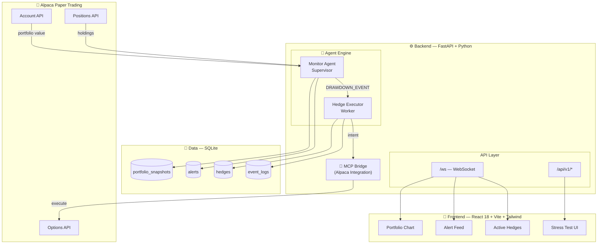

<div align="center">

# 🛡️ Hedgify

### *Autonomous AI-Powered Portfolio Insurance*

[](https://lablab.ai/event/alpaca-ai-trading-agents-hackathon)
[](https://lablab.ai)

<p align="center">
  
</p>

</div>

---

## 🎯 The Problem

When retail investors hold equity portfolios, unexpected market shocks cause rapid, unrecoverable drawdowns. Standard stop-loss mechanisms **force complete liquidation**, crystallizing losses, triggering tax liabilities, and causing investors to miss rebounds.

> **Hedgify solves this by autonomously buying protective put options — insuring your portfolio without selling a single share.**

---

## ⚡ What It Does

| Feature | Status | Description |
|---|---|---|
| 🔍 **Real-Time Monitoring** | ✅ Complete | Polls Alpaca paper trading every 15 min for live portfolio value |
| 📉 **Drawdown Detection** | ✅ Complete | Calculates peak-to-trough decline; fires alert at ≥2% threshold |
| 🤖 **Multi-Agent Orchestration** | ✅ Complete | Supervisor (Monitor) + Worker (Executor) with clean event handoff |
| 🛡️ **Protective Put Hedging** | ✅ Complete | Auto-calculates 5% OTM strike, 14-day expiry, places simulated order |
| 🔄 **Idempotency Guard** | ✅ Complete | Prevents duplicate hedge orders — saves capital from over-insuring |
| 📡 **WebSocket Live Push** | ✅ Complete | Real-time alert + hedge broadcasts to connected dashboards |
| 💾 **SQLite Persistence** | ✅ Complete | Full audit trail: snapshots, alerts, hedges, event logs |
| 📊 **React Dashboard** | 🚧 In Progress | Real-time portfolio cards, alert feed, active hedges table |
| 🧪 **Stress Test Simulator** | 🚧 In Progress | Synthetic crash scenarios to prove hedge efficacy |
| 🔌 **MCP Bridge** | 📋 Planned | Model Context Protocol integration for universal broker support |

---

## 🏗️ Architecture



---

## 🧠 The Agentic Pipeline

```
┌─────────────────┐     ┌──────────────────┐     ┌─────────────────┐
│  Monitor Agent  │────►│  DRAWDOWN_EVENT  │────►│ Hedge Executor  │
│   (Supervisor)  │     │   {symbol, drop} │     │    (Worker)     │
│                 │     │                  │     │                 │
│ • Polls Alpaca  │     │                  │     │ • Checks DB for │
│ • Tracks peak   │     │                  │     │   existing hedge│
│ • Detects ≥2%   │     │                  │     │ • Calculates    │
│   drop          │     │                  │     │   5% OTM put    │
│ • Fires event   │     │                  │     │ • Places order  │
└─────────────────┘     └──────────────────┘     └─────────────────┘
         │                                                    │
         ▼                                                    ▼
   ┌──────────┐                                       ┌──────────┐
   │  SQLite  │                                       │  SQLite  │
   │  alerts  │                                       │  hedges  │
   └──────────┘                                       └──────────┘
         │                                                    │
         └────────────────────┬───────────────────────────────┘
                              ▼
                    ┌──────────────────┐
                    │  WebSocket Push  │
                    │  to React Dash   │
                    └──────────────────┘
```

---

## 🛠️ Tech Stack

### Backend


### Frontend


### Brokerage & Protocols


---

## 🚀 Quick Start

### Prerequisites
- Python 3.11+
- Node.js 18+
- Alpaca Paper Trading API keys

### 1. Clone & Setup Backend
```bash
git clone https://github.com/builtbyrehan/hedgify.git
cd hedgify/backend

python -m venv venv
source venv/bin/activate  # Windows: .\venv\Scripts\activate
pip install -r requirements.txt
```

### 2. Configure Environment
```bash
cp .env.example .env
# Edit .env with your Alpaca Paper Trading keys:
# ALPACA_API_KEY=PK...
# ALPACA_SECRET_KEY=...
```

### 3. Run Backend
```bash
python -m uvicorn main:app --reload
# API: http://localhost:8000
# WebSocket: ws://localhost:8000/ws
# Health: http://localhost:8000/health
```

### 4. Setup Frontend (In Progress)
```bash
cd ../frontend
npm install
npm run dev
# Dashboard: http://localhost:5173
```

---

## 📡 API Endpoints

| Endpoint | Method | Description |
|---|---|---|
| `/health` | GET | Service health check |
| `/api/v1/portfolio` | GET | Latest portfolio snapshot + peak + drawdown |
| `/api/v1/alerts` | GET | Full alert history with statuses |
| `/api/v1/hedges` | GET | All active and expired hedges |
| `/ws` | WebSocket | Live push: alerts, hedges, portfolio updates |

---

## 🧪 Verified Behaviors

✅ **Drawdown Capture:** 3% simulated drop triggers alert within 10 seconds  
✅ **Idempotency:** 16 consecutive alerts correctly reduced to 1 hedge order  
✅ **State Recovery:** SQLite persists peak value across restarts  
✅ **Real-Time Push:** WebSocket broadcasts alert + hedge confirmation  
✅ **Alpaca Integration:** Live account value + position fetching verified  

---

## 🗺️ Roadmap

| Milestone | Target | Status |
|---|---|---|
| Backend scaffold + database | Day 1 | ✅ Complete |
| Alpaca client + Monitor Agent | Day 2 | ✅ Complete |
| Hedge Executor + idempotency | Day 3 | ✅ Complete |
| REST API + WebSocket layer | Day 3 | ✅ Complete |
| React dashboard scaffold | Day 4 | 🚧 In Progress |
| Real-time charts + alert feed | Day 4 | 📋 Planned |
| Stress test simulator UI | Day 5 | 📋 Planned |
| MCP server integration | Day 5 | 📋 Planned |
| Real options order execution | Day 6 | 📋 Planned |
| Demo video + documentation | Day 7 | 📋 Planned |

---

## 🎓 Academic & Professional Context

This project demonstrates:
- **Quantitative Finance:** Protective put hedging, drawdown mathematics, risk budgeting
- **Multi-Agent Systems:** Supervisor-Worker orchestration with event-driven architecture
- **Production Engineering:** Idempotency, fault tolerance, state recovery, structured logging
- **Financial API Integration:** Live brokerage connectivity with real market data
- **Real-Time Systems:** WebSocket push architecture for sub-second dashboard updates

---

## 👥 Team Hedgify

Built for the **Alpaca AI Trading Agents Hackathon** hosted by [lablab.ai](https://lablab.ai)

---

<div align="center">

**[⭐ Star this repo](https://github.com/builtbyrehan/hedgify)** if you find the architecture useful.

*Built with discipline. Shipped with purpose.*

</div>
